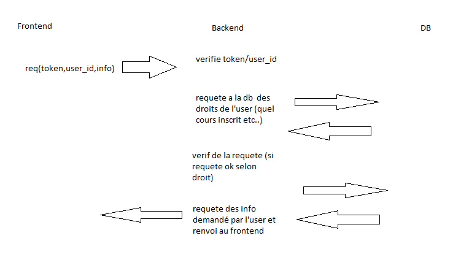

# Conception Technique

##### Projet de semestre Alves, Cuénoud, Dupont, Mülhauser, Simonet


## Présentation des l'API

Pour la réalisation de notre application web nous somme parti sur un environnement  **MEAN stack**

**M** – MongoDB, NoSQL (non-relational) database.

**E** – Express back-end middleware.

**A** – Angular front-end framework.

**N** – Node.js runtime environment.

cette environnement a de nombreux avantage:

 1. La plupart des outils sont open source et gratuit (exemple MongoDB propose un hébergent gratuit et de  bonne qualités).
 2. Relativement facile a prendre en main et il existe de nombreux exemple et librairie sur internet.
 3. Agular est un framwork qui permette au code de rester structuré et evite que le projet parte danstout les sens.
  

## Étude détaillée des un points particulier

### Spécification Backend

Le backend va servir à connecter le frontend (corogram) fait en angular avec la database. 

Son rôle va être de garantir que l’utilisateur peut READ/WRITE seulement ce qu’il à le droit. 

Les informations montrées à l’utilisateur seront amenée comme ceci : 


la communication entre le backend et le frontend (corogram) s' effectue via de requête `http`

Avec angular et la librairie http on peut très facilement implémenter un requête de cette façon:

 

     public getMessages(courseId: string): Observable<ChatMessage[]> {
        return this.http.get<ChatMessage[]>(this.chatUrl + '/' + courseId).pipe(
          catchError(this.handleError<ChatMessage[]>('getMessages', [])));
      } 
*exemple de le requête qui récupérer les message du chat.*


### Format des contenus échangé entre les différents services.

Toutes les vérification pour Read/Write/Update seront côté backend.

TODO: Décider comment on implémente les messages ensemble, par exemple est-ce que on peut envoyer des média dans le chat/forum.

- `ChatMessage`: Object JSON sous forme

  ```
  {
  	id: number; # id unique du ChatMessage
  	author: String; # id unique de l'auteur du message
  	content: String; # contenu du message 
  	timestamp: String; # heure exacte du message au format __ A DEFINIR __  
      course_id: String; # Permet d'identifier a quel cours ce message appartient
  }
  ```

- `ForumMessage`:

  ```
  {
  	id: number; # id unique du ForumMessage
  	author: String; #id unique de l'auteur du message
  	title: String; #titre du ForumMessage
  	content: String;# contenu du post
  	timestamp: String;# heure exacte du message au format __ A DEFINIR __  
  	upVote: number; # nombre de votes positifs
    downVote: number; # nombre de votes négatifs
  	course_id: String; # Permet d'identifier a quel cours ce message appartient
  }
  ```

- `Course`:

  Sert à recevoir et échanger des information sur les cours auquel l’utilisateur est inscrit.

  ```
  {
      id: number; # id unique qui permet d'identifier la classe (du cours donné)
      name: String; # le nom complet p.ex "Programmation Concurrente 2020"
      shortName: String; # Le nom court du cours (RES pour réseaux par exemple)
  }
  ```

- `User`:

  Sert à définir le statut d’un utilisateur afin de déterminer ses droits.

  ```
  {
  	id: number; #id unique de l'utilisateur
      name: String; # nom complet de l'utilisateur
      mail: String; # mail de l'utilisateur
      status: String; #le status de l'utilisateur
      course: id[]; #les cours auxquel participe l'étudiant 
  }
  ```

  - `status` doit être soit : `PROF` soit `STUD` soit `ADMIN` .

   Par exemple un champs : `courseGiven: number[]`qui contiendrait les id des cours auxquels l’user est admin.

### Partie Authentification

  A definir: [bon lien sur l'authentification avec angular et JWT](https://blog.angular-university.io/angular-jwt-authentication/)

  `api/login` `POST`

  ```
  { userId, passWord }
  ```

  Renvoie un token JWT si sucessfull

  Sinon renvoie `Unauthorized` (HTML erreur 401).


Lien utile :

Sur JWT mangodb et angular : https://developer.okta.com/blog/2019/09/11/angular-mongodb


### Upload de fichers sur MangoDB
#### fontend => backend
Pour upload un ficher il faut pour commencer l' envoyer sur le backend  pour réaliser cela nous utilisons une API faite pour Angular `ng2-file-upload`  voir: https://valor-software.com/ng2-file-upload/

Nous avons choisis cette API car elle est très simple d' utilisation et permet d' implémenter par exemple une drag and drop zone:
 

    <div class="form-group">
            <label>Choose file(s)</label>
            <div ng2FileDrop
                 [ngClass]="{'nv-file-over': hasBaseDropZoneOver}"
                 [uploader]="uploader"
                 class="well my-drop-zone">
              .<strong>{{ uploader.queue[0]?.file?.name }}</strong>.
            </div>
     </div>
#### backend => MangoDB
Il existe plusieurs possibilité d' upload des fichiers sur mango DB 
Par exemple on peux envoyer en BSON mais le problème avec cette technique et que la taille des fichier est  limité à 16 MB sur mangoDB.

C’est pourquoi  nous avons utilisé une API qui découpe le fichier en petit bout (*chunk*) et s' occupé de faire le lien entre tous pour pouvoir les récupérer .
Nous avons choisi l' API `multer-gridfs-storage` voir: https://github.com/devconcept/multer-gridfs-storage

### Gestion des nouveau message via des envents
Frontend doit régulièrement aller chercher les nouveaux message arrivé sur la DB Il y a deux possibilités pour réaliser celas 

 1. Le frontend vas lui même interroger la DB (via le backend) toutes les 2-3 seconds.
 2. Le backend envois un event (pour indiquer au frontend que de nouveau message sont disponible sur la DB.

La méthode retenue est la 2  car la 1 n' est pas optimisé pour un grand nombre d' utilisateur car si par exemple 100 personne utilises notre application il y aura 60000 requête sur le backend par minutes alors que peut être seulement 2 ou 3 messages auront été envoyés.    
exemple de code coté backend qui permette de s' abonner a un event:

    const EventEmitter = require('events');
    const stream = new EventEmitter();
    
    exports.get_event = function(req,res){
      res.writeHead(200, {
        'Content-Type':'text/event-stream',
        'Cache-Control':'no-cache',
        Connection: 'keep-alive'
      });
      
      stream.on('push', function (event, data) {
        res.write('event:'+String(event)+'\n'+'data:'+ JSON.stringify(data)+'\n\n');
      })
    };
Il faut ensuite que le frontend s' abonne a l' event 


    private ChatEventUrl = '/api/event/chat';
      private ForumEventUrl = '/api/event/forum';
      constructor(private _zone: NgZone) {}
    
      public getServerSentChatEvent(): Observable<any> {
        return Observable.create((observer) => {
          const eventSource = this.getEventSource(this.ChatEventUrl);
           eventSource.onmessage = (event) => {
            this._zone.run(() => {
              observer.next(event);
            });
          };
        eventSource.onerror = (error) => {
            this._zone.run(() => {
              observer.error(error);
            });
          };
        });
      }
