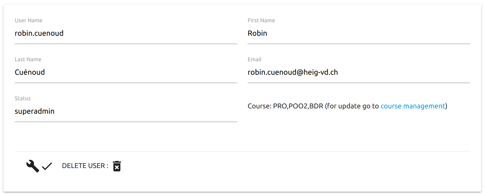

# Manuel utilisateur

##### Projet de semestre Alves, Cuénoud, Dupont, Mülhauser, Simonet

### Utilisateur simple, élève

#### Page de Login

A la page de login il faut entrer son username et son mot de passe. Le bouton forget my password permettra une fois implémenté d'envoyer un mail à l'addresse du user pour le reset.
* superadmin: login: admin, password: admin
* admin: login: test, password: admin
* normal user: login: flo, password: 1234

#### Page d'accueil de l'application

La barre verticale à gauche permet la navigation au travers des différents cours ainsi que l'accès aux deux menus gestion des cours et gestion des users pour les personnes habilitées.

#### Page d'un cours sans message

On peut écrire un message de type chat ou bien un message de type forum. Lors de l'édition d'un message de type forum on peut drag and drope un fichier pour l'attacher à notre poste.

#### Page d'un cours avec des messages dans le chat et le forum

Un message de type chat peut être transféré, par une personne ayant droit, dans le forum à l'aide de la flêche verte qui est attachée à celui-ci. Les messages du forum peuvent être upvote/downvote à l'aide des flêches ^/v par tous les utilisateurs. La suppression des messages du forum peut être faite avec la croix en bas à gauche du poste.

### Utilisateur admin, professeur ou assistant

#### Page de gestion de cours

Un cours peut être créé avec la partie supérieure de l'interface. Dans la partie inférieure on peut voir les cours disponibles, une recherche est possible via la barre prévu à cet effet. Le clique sur un cours permet d'accèder à ses options. La croix quant à elle permet la suppression du cours.

Une fois un clique effectué sur un cours on peut séléctionner des participants pour celui-ci et ensuite valider pour les y ajouter.

### Super Admin

#### Page de gestion des users

Sur cette page comme pour celle des cours on peut procèder à la création d'un utilisateur ainsi que voir la liste de tous ceux-ci. Une barre de recherche permet de retrouver un utilisateur.

Un clique sur la clé à molette d'un utilisateur permet de pouvoir changer les champs de son compte.

