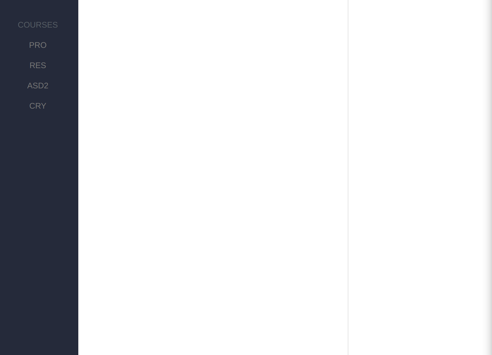

# Manuel utilisateur

##### Projet de semestre Alves, Cuénoud, Dupont, Mülhauser, Simonet

TODO, faire des captures d'écran des différents menus et les expliquer

### Utilisateur simple, élève

#### Page de Login

La barre verticale à gauche permet la navigation au travers des différents cours.

#### Page d'accueil de l'application

#### Page d'un cours sans message

#### Page d'un cours avec des messages dans le chat et le forum

* tableau cours inscrit
* chat:
Les admins peuvent cliquer sur le bouton du message, jugé utile à mettre en avant, afin de le sélectionner pour le basculer dans le forum.
* forum
Nous pouvons upvote/downvote les messages du forum afin de juger de la pertinence. Les posts les plus upvotés apparaitrons directement en haut.

### Utilisateur admin, professeur ou assistant

TODO

* page création des cours

#### Page de gestion de cours

* inscription des élèves
* modération

### Super Admin

#### PAge de gestion des users

* page d'admin, de gestion des users
## fin de page 
