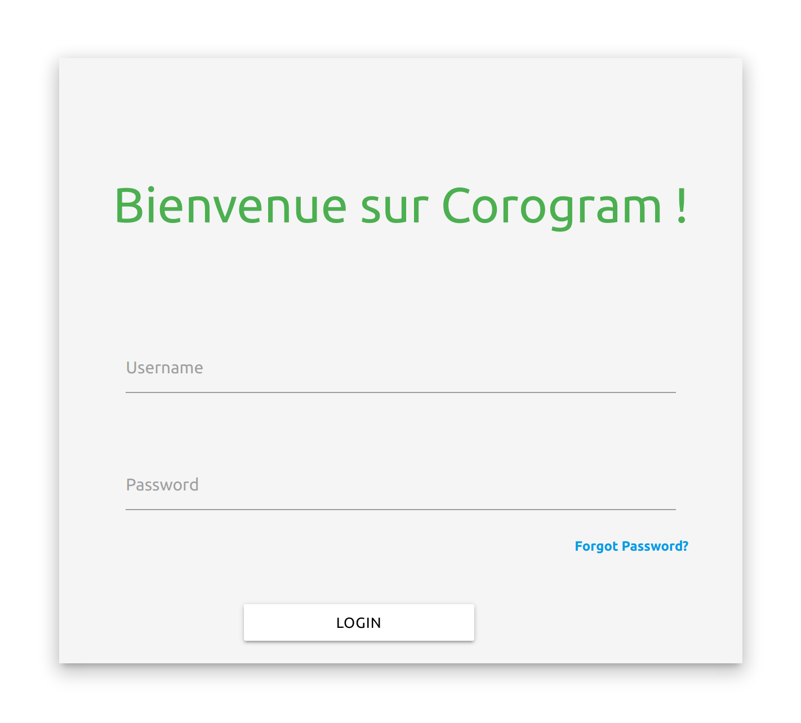
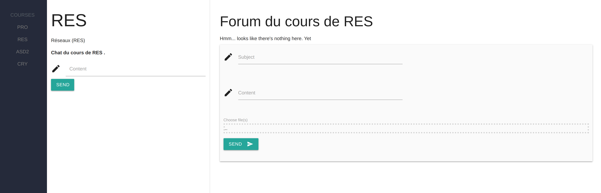
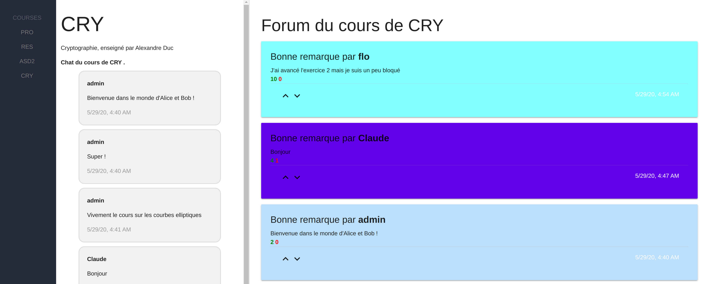

# Manuel utilisateur

##### Projet de semestre Alves, Cuénoud, Dupont, Mülhauser, Simonet

TODO, faire des captures d'écran des différents menus et les expliquer

### Utilisateur simple, élève

#### Page de Login

La bar verticale à gauche permet la navigation au travers les différents cours.

#### Page d'accueil de l'application

#### Page d'un cours sans message

#### Page d'un cours avec des messages dans le chat et le forum

* tableau cours inscrit
* chat
* forum

### Utilisateur admin, professeur ou assistant

TODO

* page création des cours

#### Page de gestion de cours

* inscription des élèves
* modération

### Super Admin

#### PAge de gestion des users

* page d'admin, de gestion des users
