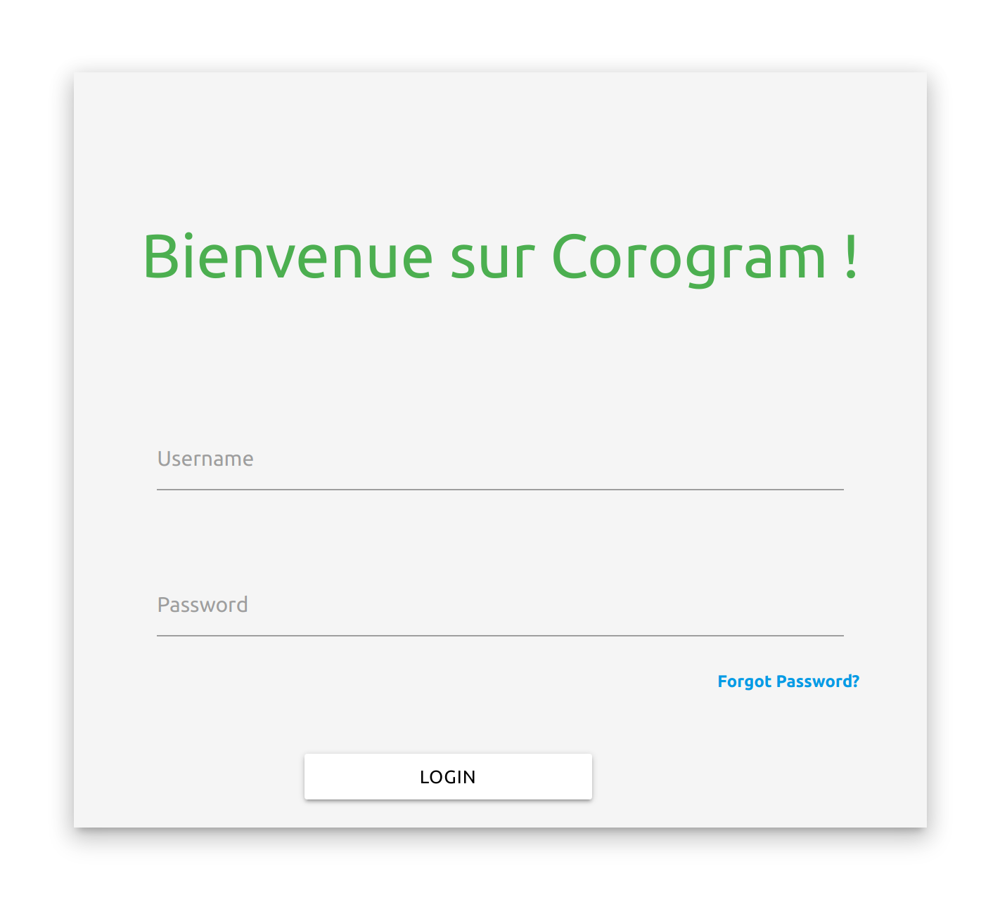
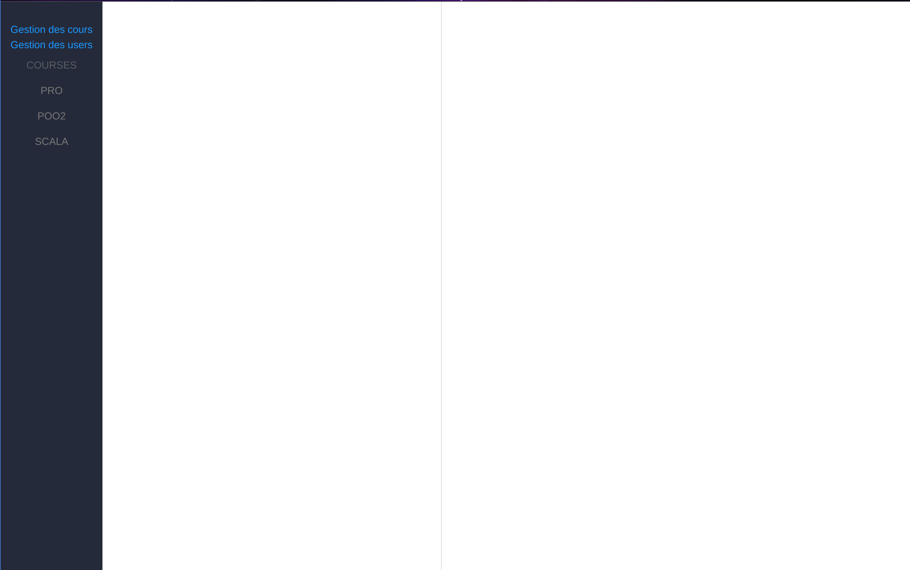
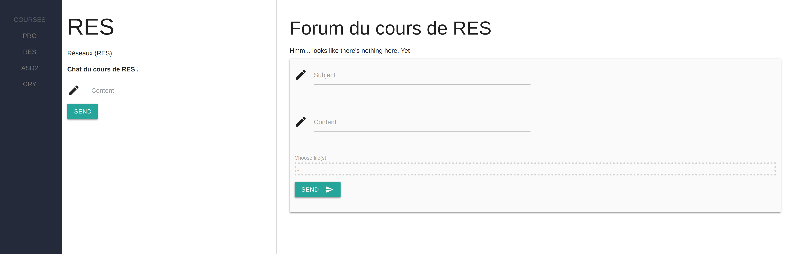
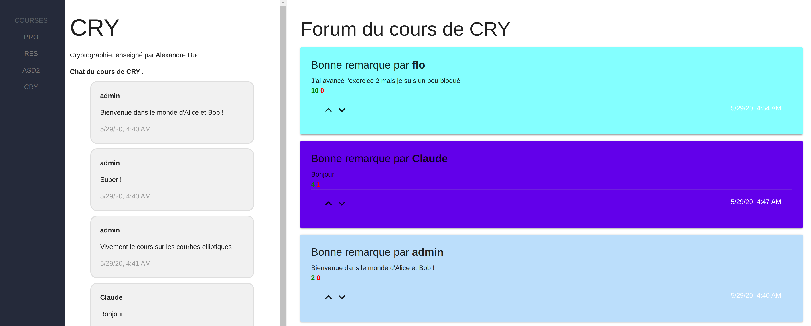
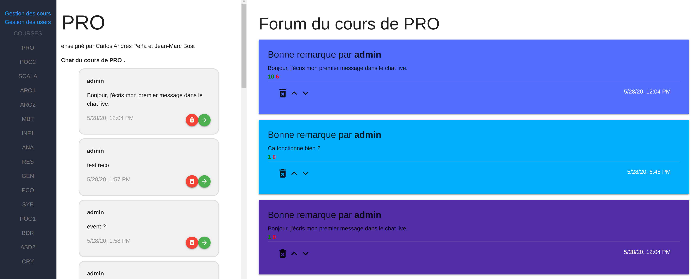
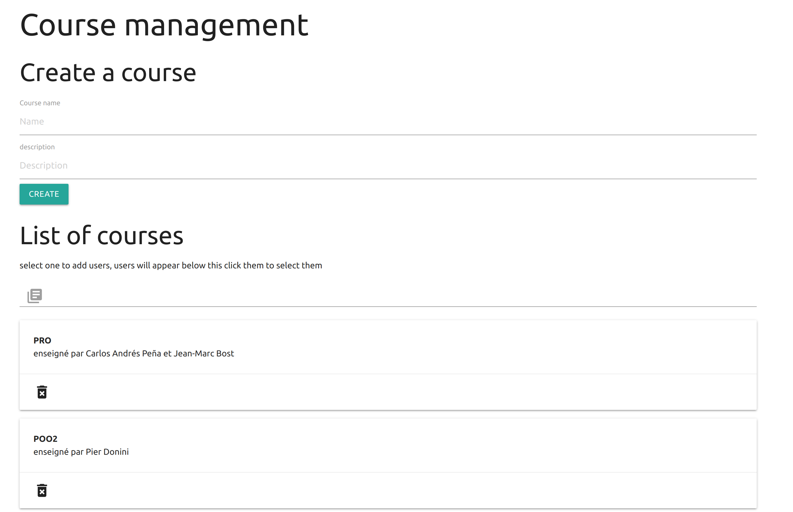
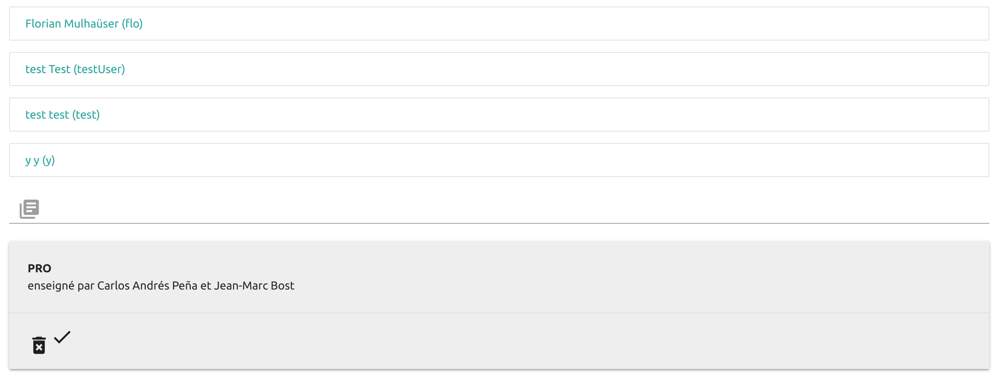
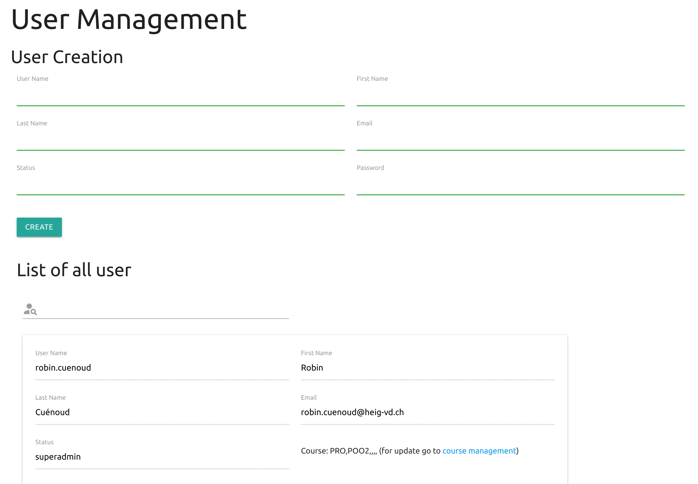
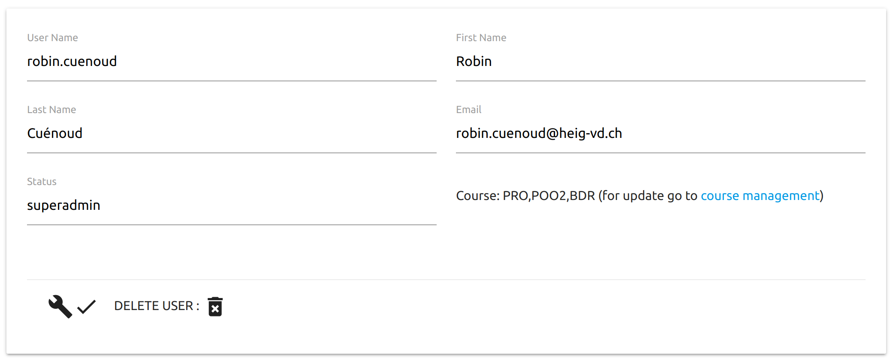

# Table des matières
1. [Présentation](#presentation)
2. [Guide d'installation](#guideInstallation)
3. [Organisation du code](#organisationCode)
4. [Conception technique](#conception)
5. [Suivi qualité](#suiviQualite)
6. [Manuel utilisateur](#guideUtilisateur)

# Outils de participation en cours <a name="presentation"></a>

Un système de cours participatif qui permet à une classe de chatter ensemble pour réagir au cours, puis de sélectionner des questions réponses pertinentes dans un forum, et enfin de partager des fichiers.   

HEIG-VD  |  Dépt. TIC  |  Cours PRO  |  Année académique 2019/20 | groupe A-12

Équipe de développement:

| Name                                | Email                               | Github                     |
| ----------------------------------- | ----------------------------------- | -------------------------- |
| Claude-André Alves                  | claude-andre.inacioalves@heig-vd.ch | ClaudeAlves                |
| Robin Cuénoud                       | robin.cuenoud@heig-vd.ch            | robincuenoud               |
| Maxime Dupont (deputy project lead) | maxime.dupont@heig-vd.ch            | MaximeADupont              |
| Florian Mülhauser (project lead)    | florian.mulhauser@heig-vd.ch        | FlorianMulhauser & Florian |
| Yoann Simonet                       | yoann.simonet@heig-vd.ch            | yoannsim                   |

## Dépendances

Le logiciel à préalablement besoin de ces dépendances là, les autres seront automatiquement installés ultérieurement avec un `npm install`.

* NodeJs 12.16.3
* npm 6.14.4
* Angular CLI 9.1.7 (normalement minimum 9.0.6 c'est bon)
* Typescript 3.1

## Téléchargements et installations

Dans un cas final ou le produit serait utilisé par plusieurs personnes, il serait hébergé sur un serveur et il faudrait juste se connecter à la webapp en saississant le bon URL sur votre navigateur et en s'identifiant. On a pensé que ça ne servait à rien de se concentrer là dessus pour notre projet, nous allons donc vous montrer comment l'installer et le faire tourner en local. Ce sera donc la même démarche que pour une équipe qui reprendrait le développement de cette application.

### 1. Télécharger les dépendances principales requises

* Node: il faut donc télécharger et installer `npm` (https://nodejs.org/en/download/) version min 12.16.3 ou +
* Typescript: ouvrir un shell et taper `npm install -g typescript` (le `-g` est pour une installation globale)
* Typescript compiler: `npm install -g typescript-compiler`
* angular-cli: `npm install -g angular-cli`

### 2. Télécharger le logicielle et installation automatique de ces dépendances

* Git clone ce projet, ou télécharger la dernière release disponible sur ce git.
* Dans `heigvd-pro-a-12-2020/backend`, lancer un shell et taper `npm install`
* Dans `heigvd-pro-a-12-2020/corogram`, lancer un shell et taper `npm install` 

## Exécution

### A) Marche a suivre

* Dans `heigvd-pro-a-12-2020/corogram`, ouvrir un shell et lancer la commande : `ng serve --proxy-config proxy.conf.json` 

(sans le fichier proxy les requêtes ne sont pas fait au backend)

* Dans `heigvd-pro-a-12-2020/backend`, ouvrir un shell et lancer la commande: `npm start` 

* Ensuite avec votre navigateur aller sur `http://localhost:4200/` 

#### B) Infos de connexions dev

* login user : testUser, password: admin
* login administrateur: admin, password: admin

#### C) Références utiles pour le lancement d'angular 

En cas de besoin, plus d'explications pour lancer l'environement, notament pour mettre en place un IDE, sont disponible avec ce lien.

* https://developer.ibm.com/recipes/tutorials/angular-2-set-up-and-other-quick-debugging-tips/

#### D) Erreur potentielles au lancement et solutions

En cas d'erreur en rentrant des commandes avec npm/ng au point A), certaines rencontrées sont répertoriées, voir fichier: rapports/guide_installation.md

## Documentation

Guide d'utilisateur: voir fichier `rapports/manuel_utilisateur.md`

API documentation: voir fichier `rapports/conception_technique.md`

# Guide d'installation <a name="guideInstallation"></a>


### 1. Dépendances à installer pour Angular

* Node: il faut donc installer `npm` (https://nodejs.org/en/download/) versionX
* Typescript: ouvrir un shell et taper `npm install -g typescript` (le `-g` est pour une installation globale)
* Typescript compiler: `npm install -g typescript-compiler`
* angular-cli: `npm install -g angular-cli`

### 2. Installer le projet

* clone le projet / la release sur github

* Dans `heigvd-pro-a-12-2020/backend`, lancer `npm install`

* Dans `heigvd-pro-a-12-2020/corogram` lancer `npm install` 

### 3. Lancer le projet 

#### A) Marche à suivre

* Dans `corogram` lancer la commande : `ng serve --proxy-config proxy.conf.json` 

(sans le fichier proxy les requêtes ne sont pas fait au backend)

* Dans `backend` lancer `npm start` 

* Ensuite avec votre navigateur aller sur `http://localhost:4200/` 

* Pour l’instant il faut utiliser les credentials `admin` et`admin` 

#### B) Infos de connexions dev

* superadmin: login: admin, password: admin
* admin: login: test, password: admin
* normal user: login: flo, password: 1234

#### C) Références utiles pour le lancement d'angular 

* https://developer.ibm.com/recipes/tutorials/angular-2-set-up-and-other-quick-debugging-tips/

#### Erreur potentielles au lancement et solutions

##### Erreur lors de commande avec ng serve/build/test 

> You have to be inside an angular-cli project in order to use the serve command.

Solution, sorte de mise à jour d'angular cli

```
sudo npm uninstall -g angular-cli @angular/cli

sudo npm cache clean --force

npm install npm@latest -g

sudo npm install -g @angular/cli

npm rebuild node-sass --force
```

#### Contacts en cas de problèmes non répertoriés (Support)  

Vous pouvez nous contacter à tout moment via ce groupe Telegram crée pour l'occasion.

https://t.me/joinchat/CsZHMBnR3oGc9_QiHqVA4g

# Organisation du code <a name="organisationCode"></a>

À partir de la racine heigvd-pro-a-12-2020, on a accès au README principal de présentation, puis 3 dossiers. Chaque dossier contient un README qui explique comment utiliser cette partie du code, et donne divers références. Voilà ces trois répertoires:

### 1) Rapports

Ici nous avons nos markedown des différents rapports. C'est la documentation à lire pour donner les informations. On retrouve:

##### Le guide d'installation

Ce guide nous indiques en premier lieu les logiciels requis à l'installation de notre projet, comment les installer. Ensuite il montre étape par étape comment installer le projet et le lancer.

##### Le manuel d'utilisation

Ce manuel permet de faire une présentation fonctionnelle du logiciel. Il va donner une idée des interactions utilisateurs. On présentera donc les différents types d'utilisateurs(élèves, profs, admin) et les différents menus/permissions auxquels ils ont accès. On montre comment faire les actions pour atteindre les buts pratique du logiciel.

##### Organisation du code

C'est le markdown que vous êtes en train de lire. Il présente rapidement l'arborescence et les contenus des différentes parties du projet.

##### Conception technique

Ce rapport sur la conception technique présente l'architecture technique du projet. Il va expliquer l'API, et montrer comments les différentes parties intéragissent ensemble, les connexions entre le frontend et le backlend.Il va donc décrire le fonctionnement du backend et du frontend.


##### Suivi qualité

Ici on explique nos procédures de vérifications de qualité, comme par exemple notre test de la procédures d'installation etc.

## 2) Coronagram

### e2e

Cela permet d'effectuer des test complets end-to-end du code avec Protractor.

### src

Ce dossier contient le principal de l'application

##### Karma

Outil pour effectuer différents test unitaires du code, notament en utilisant réelement des browser.

##### Config proxy

Fichier de configuration pour le proxy

##### Angular Json -> login page

#### C) app

Ici il y a le coeur de l'application. On retrouve tous les componnents de l'app, dans angular toute les sous partie sont organisé en componnent (login,Forum,chat ..)


    ├───app
    │   ├───admin
    │   │   ├───course-management
    │   │   └───user-management
    │   ├───auth
    │   ├───chat
    │   ├───course-detail
    │   ├───course-list
    │   ├───courses
    │   ├───forgot
    │   ├───forum
    │   ├───home
    │   ├───login
    │   ├───modal
    │   ├───page-not-found
    │   ├───pip
    │   └───_service
    │       ├───auth
    │       ├───chat
    │       ├───course
    │       ├───file
    │       ├───forum
    │       ├───modal
    │       ├───random-color
    │       ├───sse
    │       └───user
    ├───assets
    └───environments


## 3) Backend

C'est ici que se trouve le sevrer qui va aller stocker les données dans la DB.

##### Server JS

fichier de base qui lance  notre sevrer qui effectue la connexion avec la DB

##### JWT token pour l'authentification

### API

contiens toute le sous partie du server

    ├───api
    │   ├───controllers
    │   ├───models
    │   └───routes
    ├───images
    └───node_modules


#### controllers

contiens le code qui effectue les requêtes sur la DB et les traitement 

#### models

contiens les modèle de donné qui serons dans la DB.

#### route

Fait le lien (via des routes) entre les différant service de l' API backend et le frontend


# Conception Technique <a name="conception"></a>

##### Projet de semestre Alves, Cuénoud, Dupont, Mülhauser, Simonet


## Présentation des l'API

Pour la réalisation de notre application web nous somme parti sur un environnement  **MEAN stack**

**M** – MongoDB, NoSQL (non-relational) database.

**E** – Express back-end middleware.

**A** – Angular front-end framework.

**N** – Node.js runtime environment.

cette environnement a de nombreux avantage:

  1. La plupart des outils sont open source et gratuit (exemple MongoDB propose un hébergent gratuit et de  bonne qualités).
  2. Relativement facile a prendre en main et il existe de nombreux exemple et librairie sur internet.
  3. Agular est un framwork qui permette au code de rester structuré et evite que le projet parte danstout les sens.


## Étude détaillée des points particulier

### Spécification Backend

Le backend va servir à connecter le frontend (corogram) fait en angular avec la database. 

Son rôle va être de garantir que l’utilisateur peut READ/WRITE seulement ce qu’il à le droit. 

Les informations montrées à l’utilisateur seront amenée comme ceci : 

L’application angular (corogram) émets des requêtes sur l’API du backend en fournissant un token JWT comme paramètres. Si le token est valide (sauf pour le login ou l’utilisateur n’a pas encore de token), le backend va récuperer l’utilisateur (grâce a son id signé dans le token) et effectuer la requête en vérifiant au préalable si l’utilisateur à le droit de l’effectuer. Sinon il renvoie une erreur 403 (authorization). 

 

la communication entre le backend et le frontend (corogram) s' effectue via de requête `http`

Avec angular et la librairie http on peut très facilement implémenter un requête de cette façon:

 

```typescript
 public getMessages(courseId: string): Observable<ChatMessage[]> {
    return this.http.get<ChatMessage[]>(this.chatUrl + '/' + courseId).pipe(
      catchError(this.handleError<ChatMessage[]>('getMessages', [])));
  } 
```

*exemple de le requête qui récupérer les message du chat.*

Le `http-interceptor` permet à angular de lier le token  JWT à chaque requête.


Le backend est nécessaire car sinon nous devrions stocker nos credentials en clair sur l’application angular pour les accès à la database. Deplus il nous permet de vérifier les droits des utilisateurs et de leur générer/verifier les token JWT.


### Format des contenus échangé entre les différents services.

Toutes les vérification pour Read/Write/Update seront côté backend.

TODO: Décider comment on implémente les messages ensemble, par exemple est-ce que on peut envoyer des média dans le chat/forum.

- `ChatMessage`: Object JSON sous forme

  ```
  {
  	id: number; # id unique du ChatMessage
  	author: String; # id unique de l'auteur du message
  	content: String; # contenu du message 
  	timestamp: String; # heure exacte du message au format __ A DEFINIR __  
      course_id: String; # Permet d'identifier a quel cours ce message appartient
  }
  ```

- `ForumMessage`:

  ```
  {
  	id: number; # id unique du ForumMessage
  	author: String; #id unique de l'auteur du message
  	title: String; #titre du ForumMessage
  	content: String;# contenu du post
  	timestamp: String;# heure exacte du message au format __ A DEFINIR __  
  	upVote: number; # nombre de votes positifs
    downVote: number; # nombre de votes négatifs
  	course_id: String; # Permet d'identifier a quel cours ce message appartient
  }
  ```

- `Course`:

  Sert à recevoir et échanger des information sur les cours auquel l’utilisateur est inscrit.

  ```
  {
      id: number; # id unique qui permet d'identifier la classe (du cours donné)
      name: String; # le nom complet p.ex "Programmation Concurrente 2020"
      shortName: String; # Le nom court du cours (RES pour réseaux par exemple)
  }
  ```

- `User`:

  Sert à définir le statut d’un utilisateur afin de déterminer ses droits.

  ```
  {
  	id: number; #id unique de l'utilisateur
      name: String; # nom complet de l'utilisateur
      mail: String; # mail de l'utilisateur
      status: String; #le status de l'utilisateur
      course: id[]; #les cours auxquel participe l'étudiant 
  }
  ```

  - `status` doit être soit : `PROF` soit `STUD` soit `ADMIN` .

   Par exemple un champs : `courseGiven: number[]`qui contiendrait les id des cours auxquels l’user est admin.

### Partie Authentification

  A definir: [bon lien sur l'authentification avec angular et JWT](https://blog.angular-university.io/angular-jwt-authentication/)

  `api/login` `POST`

  ```
  { userId, password }
  ```

  Renvoie un token JWT si sucessfull

  Sinon renvoie `Unauthorized` (HTML erreur 401).


Lien utile :

Sur JWT mangodb et angular : https://developer.okta.com/blog/2019/09/11/angular-mongodb


Le shéma utilisé est le suivant : 

L’utilisateur envoie en requête http son userId et son password. Cet envoi se fait sans chiffrement car on suppose que notre application sera en https et ainsi n’est pas responsable du chiffrement de ses requêtes. 

Le backend reçoit cela et vérifie en comparant le userId avec ceux stocké sur la database puis le hash du password. Actuellement c’est l’algorithme `sha512` qui est utilisée et la librairie crypto. 

(voila le retour de la fonction de hashage)

```typescript
return crypto.pbkdf2Sync(password,salt,100000,64,'sha512').toString('hex');
```

Néamoins dans un souçis de dévellopement futur nous avons prévu de stocker l’algorithme utilisé dans la database pour que si nous changons d’algorithme nous puissions quand même authentifier des users qui n’auraient pas mis à jour leur mot de passe. 

Nous stockons le hash du mot de passe (salé) sur notre database afin qu’en cas de fuite/dump les hash ne soient pas comparable entre eux et qu’il faille recommencer le processus de crack (bruteforce ou autre) sur chaque utilisateur. 

Une fois que l’utilisateur est authentifié, le backend génère un token JWT signé avec le secret contenu dans `backend/config.json`, plus tard nous pourrions migrer à une cryptographie à clef publique/privée pour que l’utilisateur puisse authentifier nos message de son côté mais nous n’avons pas jugé prioritaire de le faire.

Les tokens JWT stockent plusieurs informations, une date d’expiration (pour pas qu’un vol de token soit grave), et l’id de l’utilisateur. Ces informations sont signées par nous, on peut donc être sur que cet utilisateur est bien authentifié. 

Les token sont stocké dans le `localStorage` pour éviter des failles XSS ou autres qui permettent assez facilement de voler les cookies. 

### Gestion des droits

Les utilisateurs peuvent avoir trois status

* superadmin peuvent read,write,update,delete tout le contenu (cours/forumPost/message/user….) 
* admin ont tous les droits sur les cours dont ils sont admin   (ajouter des gens à ce cours, promote admin/ message post)
* user   read  tous les messages/post du cours , write  nouveau message/post du cours , update message envoyé par lui meme

### Upload de fichers sur MangoDB

#### fontend => backend

Pour upload un ficher il faut pour commencer l' envoyer sur le backend  pour réaliser cela nous utilisons une API faite pour Angular `ng2-file-upload`  voir: https://valor-software.com/ng2-file-upload/

Nous avons choisis cette API car elle est très simple d' utilisation et permet d' implémenter par exemple une drag and drop zone:


    <div class="form-group">
            <label>Choose file(s)</label>
            <div ng2FileDrop
                 [ngClass]="{'nv-file-over': hasBaseDropZoneOver}"
                 [uploader]="uploader"
                 class="well my-drop-zone">
              .<strong>{{ uploader.queue[0]?.file?.name }}</strong>.
            </div>
     </div>

#### backend => MangoDB

Il existe plusieurs possibilité d' upload des fichiers sur mango DB 
Par exemple on peux envoyer en BSON mais le problème avec cette technique et que la taille des fichier est  limité à 16 MB sur mangoDB.

C’est pourquoi  nous avons utilisé une API qui découpe le fichier en petit bout (*chunk*) et s' occupé de faire le lien entre tous pour pouvoir les récupérer .
Nous avons choisi l' API `multer-gridfs-storage` voir: https://github.com/devconcept/multer-gridfs-storage


### Gestion des nouveau message via des envents

Frontend doit régulièrement aller chercher les nouveaux message arrivé sur la DB Il y a deux possibilités pour réaliser celas 

  1. Le frontend vas lui même interroger la DB (via le backend) toutes les 2-3 seconds.
  2. Le backend envois un event (pour indiquer au frontend que de nouveau message sont disponible sur la DB.

La méthode retenue est la 2  car la 1 n' est pas optimisé pour un grand nombre d' utilisateur car si par exemple 100 personne utilises notre application il y aura 60000 requête sur le backend par minutes alors que peut être seulement 2 ou 3 messages auront été envoyés.    
exemple de code coté backend qui permette de s' abonner a un event:

    const EventEmitter = require('events');
    const stream = new EventEmitter();
    
    exports.get_event = function(req,res){
      res.writeHead(200, {
        'Content-Type':'text/event-stream',
        'Cache-Control':'no-cache',
        Connection: 'keep-alive'
      });
      
      stream.on('push', function (event, data) {
        res.write('event:'+String(event)+'\n'+'data:'+ JSON.stringify(data)+'\n\n');
      })
    };

Il faut ensuite que le frontend s' abonne a l' event 


    private ChatEventUrl = '/api/event/chat';
      private ForumEventUrl = '/api/event/forum';
      constructor(private _zone: NgZone) {}
    
      public getServerSentChatEvent(): Observable<any> {
        return Observable.create((observer) => {
          const eventSource = this.getEventSource(this.ChatEventUrl);
           eventSource.onmessage = (event) => {
            this._zone.run(() => {
              observer.next(event);
            });
          };
        eventSource.onerror = (error) => {
            this._zone.run(() => {
              observer.error(error);
            });
          };
        });
      }

# Suivi qualité <a name="suiviQualite"></a>

### Beta-test d'installation

Afin de vérifier notre marche à suivre d'installation, nous avons effectué un test:

##### Procédure

Sur une machine vierge nous avons suivis point par points notre procédure d'installation, dans le but de faire tourner le projet. Il a donc fallu clone le github, installer les dépendances etc... 


##### Résultats

Ce test était dans l'ensemble un succès, car l'installation a pu être fonctionnelle en un temps correct. 

De plus, le fait de tester avec une autre personne que celle qui a écrit la procédure, a permis de tester et d'améliorer la clarté de cette dernière.

On s'est heurté à une erreur au cours du test, cela nous a permis de chercher son fix et de documenter tout ça dans une nouvelle section troubbleshoot. Ceci permettra d'éviter des ennuis à l'utilisateur final, qui trouveras directement un fix, si par malchance ce même problème de config lui arrive.

# Manuel utilisateur <a name="guideUtilisateur"></a>

### Utilisateur simple, élève

#### Page de Login

A la page de login il faut entrer son username et son mot de passe. Le bouton forget my password permettra une fois implémenté d'envoyer un mail à l'addresse du user pour le reset.
* superadmin: login: admin, password: admin
* admin: login: test, password: admin
* normal user: login: flo, password: 1234



#### Page d'accueil de l'application

La barre verticale à gauche permet la navigation au travers des différents cours ainsi que l'accès aux deux menus gestion des cours et gestion des users pour les personnes habilitées.



#### Page d'un cours sans message

On peut écrire un message de type chat ou bien un message de type forum. Lors de l'édition d'un message de type forum on peut drag and drope un fichier pour l'attacher à notre poste.



#### Page d'un cours avec des messages dans le chat et le forum

Les messages du forum peuvent être upvote/downvote à l'aide des flêches ^/v par tous les utilisateurs.



### Utilisateur admin, professeur ou assistant

#### Page d'un cours

On peut voir que les admins peuvent intervenir sur les messages en les effaçants ou en les promotant dans le forum à l'aide des boutons "poubelle" ou bien "flêche verte".



#### Page de gestion de cours

Un cours peut être créé avec la partie supérieure de l'interface. Dans la partie inférieure on peut voir les cours disponibles, une recherche est possible via la barre prévu à cet effet. Le clique sur un cours permet d'accèder à ses options. La croix quant à elle permet la suppression du cours.



Une fois un clique effectué sur un cours on peut séléctionner des participants (en cliquant dessus ou en les recherchant avec l'outil) pour celui-ci et ensuite valider pour les y ajouter.



### Super Admin

#### Page de gestion des users

Sur cette page comme pour celle des cours on peut procèder à la création d'un utilisateur ainsi que voir la liste de tous ceux-ci. Une barre de recherche permet de retrouver un utilisateur.



Un clique sur la clé à molette d'un utilisateur permet de pouvoir changer les champs de son compte.



### Lien présentation vidéo


